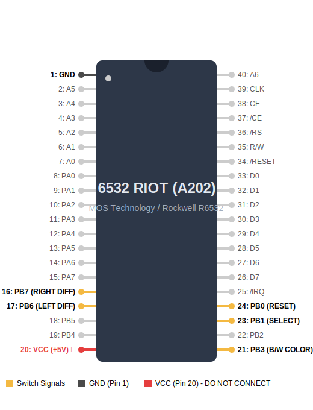
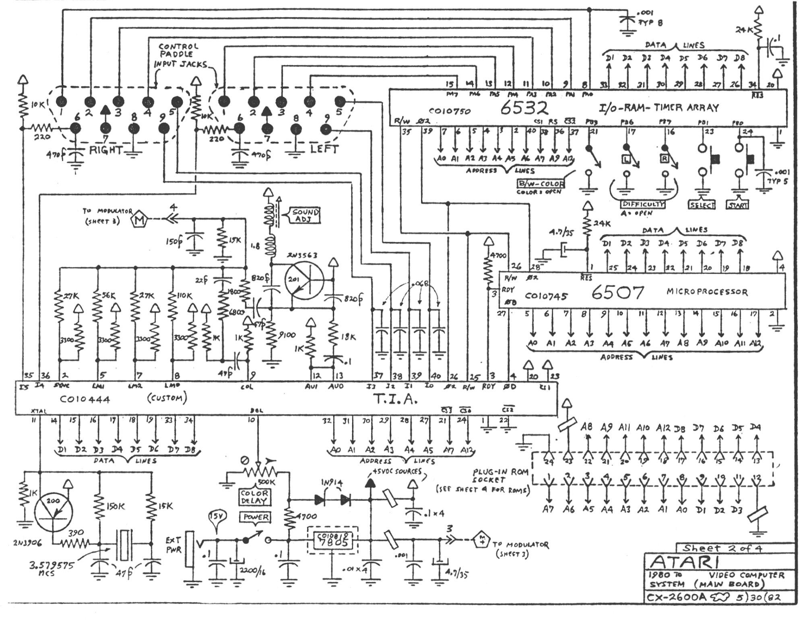
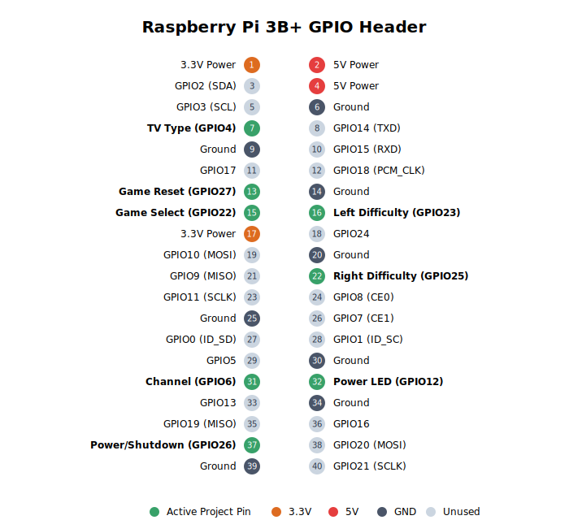
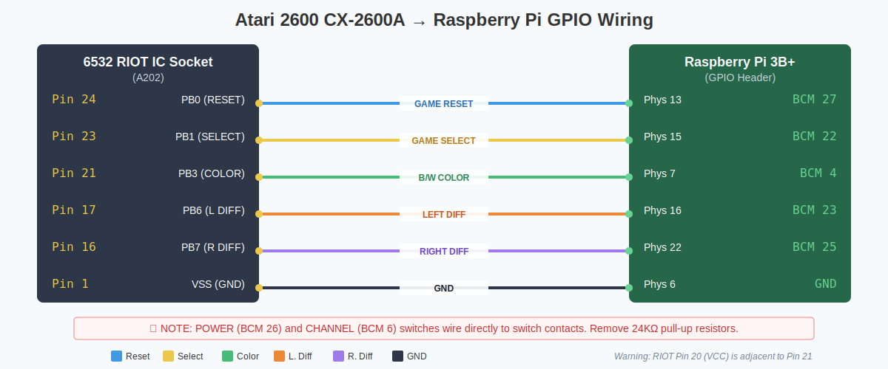

# RetroPie2600 Hardware Wiring Guide

This guide covers integrating a Raspberry Pi 3B+ into a vintage Atari 2600 CX-2600A shell. The original IC chips have been removed. The empty 6532 RIOT IC socket pin holes serve as the solder points. The project involves repurposing the original physical switches, power LED, and enclosure to create an authentic feeling Atari emulation console.

## 1. ⚠️ Safety Warnings

⚠️ **ESD Precautions:** Handle the Raspberry Pi by the edges. Ground yourself before touching GPIO pins to prevent electrostatic discharge damage.

⚠️ **Common Ground:** The Pi Ground and the Atari board ground must share a common ground bus. Ensure the GND connections from the switches are tied back to the Pi's GND pins.

⚠️ **Wire Routing:** Ensure all wires are secured with cable ties. Route wires away from the fan blades and ensure no bare wires can cross or short against the shell or other components.

⚠️ **Power Off Before Wiring:** Always disconnect the 5V power supply from the Pi before changing any GPIO connections.

## 2. Bill of Materials (BOM)

The following components are required for the conversion.

| Component | Description |
| :--- | :--- |
| **Raspberry Pi 3B+** | Main controller with built-in Wi-Fi and 40-pin GPIO header |
| **MicroSD Card** | 16GB+ recommended, Class 10 for performance |
| **2× 2600-daptor 2e** | USB adapters for original Atari joysticks and paddles |
| **2× USB Panel-Mount Cables** | Extension cables for external controller ports |
| **1× Ethernet Panel-Mount Cable** | Extension for networking access |
| **1× 5V Micro-USB Power Supply** | 2.5A minimum recommended |
| **1× 40mm 5V Fan + Heatsink** | For active cooling inside the enclosed shell |
| **1× Red LED (3mm or 5mm)** | To replace original power jack with status indicator |
| **1× 330Ω Resistor** | Current limiting for the power LED |
| **DuPont Jumper Wires** | At least 12 female-to-female wires |
| **28 AWG Hookup/Wire-Wrap Wire** | For soldering to IC socket pin holes (thin gauge fits) |
| **Solder + Soldering Iron** | For making connections to the Atari board switch pads |
| **Dremel / Rotary Tool** | For rear port cutouts (HDMI, Power, USB, Ethernet) |
| **Multimeter** | Essential for continuity testing and safety checks |

## 3. Understanding the Atari 2600 Board

The heart of the Atari 2600's switch handling was the 6532 RIOT (RAM, I/O, Timer) chip. In this project, the RIOT chip is removed because the Raspberry Pi handles all emulation. The empty 40-pin DIP socket left behind provides the most convenient access points for the original console switches.

### Locating the RIOT Socket
On the CX-2600A "4-switch" board, the A202 (RIOT) socket is the topmost large chip socket, situated closest to the row of console switches. You can identify it by the "A202" silkscreen marking on the PCB.

### Pin Identification
Identifying Pin 1 is crucial. Look for a notch or a dot marking on the socket itself. The PCB silkscreen will also typically indicate Pin 1 with a "1" or a square pad instead of a round one.

The 6532 RIOT uses a standard DIP-40 numbering scheme:
- **Pin 1:** Top-left corner (with the notch at the top).
- **Pins 1-20:** Run down the LEFT side.
- **Pins 21-40:** Run up the RIGHT side (counter-clockwise).



Each DPDT switch on the Atari board has 6 pins total. However, the PCB traces route these to specific pads on the RIOT socket. By soldering a single wire to the correct RIOT socket pad, you can capture the state of the switch without needing complex wiring directly to the switch terminals.

## 4. IC Socket Pin Reference

The following schematic reference provides the context for the Atari 2600A wiring.



### Master Mapping Table

This table defines the connection from the Atari RIOT socket to the Raspberry Pi BCM pins.

| Switch | RIOT Socket Pin | Signal Name | Pi BCM | Physical Pin | Logic |
| :--- | :--- | :--- | :--- | :--- | :--- |
| **Game Reset** | Pin 24 | PB0 | BCM 27 | Pin 13 | LOW=pressed |
| **Game Select** | Pin 23 | PB1 | BCM 22 | Pin 15 | LOW=pressed |
| **TV Type (Color/B&W)** | Pin 21 | PB3 | BCM 4 | Pin 7 | LOW=B&W, HIGH=Color |
| **Left Difficulty** | Pin 17 | PB6 | BCM 23 | Pin 16 | LOW=B/Novice, HIGH=A/Pro |
| **Right Difficulty** | Pin 16 | PB7 | BCM 25 | Pin 22 | LOW=B/Novice, HIGH=A/Pro |
| **Ground** | Pin 1 | VSS | GND | Pin 6 (or any GND) | Common reference |

**Note:** The POWER and CHANNEL switches are located on separate parts of the board and do not route through the RIOT IC socket.

## 5. GPIO Pin Assignment Table

This table summarizes the final GPIO assignments used by the `retropie2600` daemon. These pins match the default `config/switches.example.yaml`.

| Switch / Component | BCM Pin | Physical Pin | Type | Function |
| :--- | :--- | :--- | :--- | :--- |
| **Power (Shutdown)** | 26 | 37 | Toggle | `gpio-shutdown` |
| **TV Type (Color/B&W)** | 4 | 7 | Toggle (single-pin) | F3/F4 (Color/BW) |
| **Game Select** | 22 | 15 | Momentary | F1 |
| **Game Reset** | 27 | 13 | Momentary | F2 |
| **Left Difficulty** | 23 | 16 | Toggle (single-pin) | F5/F6 (A/B) |
| **Right Difficulty** | 25 | 22 | Toggle (single-pin) | F7/F8 (A/B) |
| **Channel** | 6 | 31 | Toggle (single-pin) | Shader ON/OFF |
| **Power LED** | 12 | 32 | Output | Red status LED |



## 6. IC Socket Wiring Approach

For this project, we use a single-wire approach for all console switches. The modern `retropie2600` daemon supports single-pin toggle detection, which simplifies wiring significantly compared to older dual-wire methods.

### Single-Pin Logic
Toggle positions (like Color/BW or Difficulty A/B) are determined by the HIGH or LOW voltage level on a single GPIO pin. The daemon configuration defines these positions based on the voltage state.

### Configuration Snippet
The `config/switches.example.yaml` uses the `pin` and `positions` keys to handle this:

```yaml
tv_type:
  pin: 4          # RIOT Pin 21 → BCM 4; LOW=B&W, HIGH=Color
  type: toggle
  positions:
    low: "bw"
    high: "color"
  debounce_ms: 20

power:
  pin: 26         # Direct switch; BCM 26 (Physical 37); LOW=On, HIGH=Off
  type: toggle
  positions:
    low: "on"
    high: "off"
  debounce_ms: 500
```

### Pull-Up Resistors
All switch inputs use active-low logic. The Raspberry Pi's internal pull-up resistors (PUD_UP) are configured by the `pigpio` daemon. When a switch is closed, it pulls the signal line to Ground (LOW), triggering the event.

## 7. Step-by-Step Wiring Instructions

The following diagram illustrates the full connection path from the Atari board to the Raspberry Pi.



### Game Reset (Momentary)
- **Source:** RIOT socket Pin 24. This is the 7th pin down from the top-right in the right-hand column.
- **Destination:** Raspberry Pi BCM 27 (Physical Pin 13).
- **Ground:** RIOT socket Pin 1 (Top-left corner). Connect this to any Ground pin on the Pi, such as Physical Pin 6.
- **Suggestion:** Use a white wire for the signal and a black wire for ground to stay organized.

### Game Select (Momentary)
- **Source:** RIOT socket Pin 23.
- **Destination:** Raspberry Pi BCM 22 (Physical Pin 15).
- **Ground:** Shared from the common ground connection at RIOT Pin 1.

### TV Type / B&W-Color (Toggle, single-pin)
- **Source:** RIOT socket Pin 21. This is the bottom-right corner pin.
- **Destination:** Raspberry Pi BCM 4 (Physical Pin 7).
- **Logic:** LOW = B&W (Stella F4), HIGH = Color (Stella F3).

### Left Difficulty (Toggle, single-pin)
- **Source:** RIOT socket Pin 17. This is the 6th pin up from the bottom-right.
- **Destination:** Raspberry Pi BCM 23 (Physical Pin 16).
- **Logic:** LOW = B/Novice (F6), HIGH = A/Pro (F5).

### Right Difficulty (Toggle, single-pin)
- **Source:** RIOT socket Pin 16. This is the 5th pin up from the bottom-right.
- **Destination:** Raspberry Pi BCM 25 (Physical Pin 22).
- **Logic:** LOW = B/Novice (F8), HIGH = A/Pro (F7).

### Channel Switch (Toggle, direct — SPDT, 3 contacts)
- **Note:** This switch does NOT wire through the RIOT socket. It is a standard SPDT slide switch with 3 contacts (Left, Center, Right).
- **Wiring:**
  - **Center contact → Pi GND** (any ground pin, e.g., Physical Pin 34).
  - **Right contact → Raspberry Pi BCM 6** (Physical Pin 31). This is the Ch 3 side.
  - **Left contact** — leave unwired (Ch 2 side, not needed).
- **Logic:** When set to Ch 3 (right), the right contact bridges to center (GND), pulling BCM 6 LOW. When set to Ch 2 (left), BCM 6 floats HIGH via internal pull-up.
- **Result:** LOW = Channel 3 (Shader OFF), HIGH = Channel 2 (Shader ON).

### Power Switch (Toggle, direct — non-standard 3-contact)
- **Note:** This switch does NOT wire through the RIOT socket. It has 3 contacts (Top, Middle, Bottom) but is NOT a standard SPDT — see below.
- **Switch behavior:** When **On** (up), all three contacts are bridged. When **Off** (down), only Bottom ↔ Middle are bridged; Top is disconnected.
- **Wiring:**
  - **Middle contact → Pi GND** (any ground pin, e.g., Physical Pin 39).
  - **Top contact → Raspberry Pi BCM 26** (Physical Pin 37). This is the On side.
  - **Bottom contact** — leave unwired.
- **Logic:** When On, Top bridges to Middle (GND), pulling BCM 26 LOW. When Off, Top is disconnected and BCM 26 floats HIGH via internal pull-up.
- **Result:** LOW = On, HIGH = Off. The `gpio-shutdown` overlay triggers shutdown on the LOW→HIGH transition (switch moved to Off).
- **Function:** This pin is handled by the `gpio-shutdown` dtoverlay in the system configuration, allowing for safe shutdowns.

## 8. Power LED Installation

The original Atari 2600 power jack hole is repurposed for a red status LED.

- **Anode (+):** Connect to Pi **Pin 32 (GPIO 12)** via a 330Ω resistor.
- **Cathode (-):** Connect to any Ground pin (e.g., **Pin 30**).
- **Calculation:** (3.3V - 2.0V) / 0.02A = 65Ω minimum; 330Ω provides a safe, visible brightness.

## 9. Fan Installation

Active cooling is necessary for the Pi 3B+ when housed inside the plastic Atari shell.

- **Power:** Connect the red wire to **Pin 4 (5V)**.
- **Ground:** Connect the black wire to **Pin 6 (GND)**.
- **Mounting:** Attach heatsinks to the Pi CPU and GPU. Mount the 40mm fan near the top vents of the Atari case to ensure proper exhaust airflow.
- **Optional Control:** To enable temperature-controlled activation, use `dtoverlay=gpio-fan` in `/boot/config.txt`.

## 10. Port Cutout Guide

The Raspberry Pi should be oriented so the ports face the rear of the Atari case.

1. **HDMI:** Cut a slot for a standard HDMI cable or panel-mount extension.
2. **Power:** Align with the original power entry area for micro-USB.
3. **USB/Ethernet:** Use panel-mount extensions to bring the 2600-daptor connections and network port to the rear panel.
4. **Safety:** Use a Dremel with a plastic-cutting wheel. Wear eye protection.

## 11. /boot/config.txt Configuration

Add the following lines to your `/boot/config.txt` to enable system-level hardware features:

```text
# Enable software-controlled shutdown via power switch
# active_low=0: shutdown triggers on rising edge (LOW→HIGH = switch moved to Off)
# gpio_pull=up: internal pull-up (default) — correct for this wiring
dtoverlay=gpio-shutdown,gpio_pin=26,active_low=0

# Optional: Temperature controlled fan (turns on at 60°C)
# Replace X with BCM pin if using a transistor/MOSFET driver
# dtoverlay=gpio-fan,gpiopin=X,temp=60000
```

**Note:** `gpio-shutdown` triggers a clean shutdown when the power switch is moved to Off (BCM 26 goes HIGH). Wake-from-halt via GPIO only works on **GPIO3** (a hardware SoC limitation), so BCM 26 cannot wake the Pi from a halted state — you must unplug and replug power, or wire a separate momentary button on GPIO3.

## 12. Testing Your Wiring

Once wired, you can verify the hardware integration using the system logs.

1. Power on the system and SSH into the Pi.
2. Run the following command:
   ```bash
   journalctl -u retropie2600 -f
   ```
3. Flip each switch and observe the output.

### Expected Log Output
When you interact with the switches, you should see logs similar to these:

```text
retropie2600[1234]: Switch event: tv_type → bw
retropie2600[1234]: Switch event: tv_type → color
retropie2600[1234]: Switch event: game_reset → pressed
retropie2600[1234]: Switch event: game_reset → released
retropie2600[1234]: Switch event: difficulty_left → b
retropie2600[1234]: Switch event: difficulty_left → a
```

4. If the LED does not light up, check the orientation (polarity) and the resistor connection.

## 13. Troubleshooting

- **"Pin reads HIGH all the time":** Check the Ground connection from RIOT Pin 1 to the Pi Ground. If the circuit isn't completed, the pin will never be pulled LOW.
- **"Pin reads LOW all the time":** This indicates a floating pin. Verify that the Pi's internal pull-up is enabled in the software configuration.
- **"Toggle shows same position for both switch positions":** You may have wired to the wrong RIOT socket pad. Use a multimeter in continuity mode to trace the signal from the switch to the socket pad.
- **"No events in daemon log":** 
  - Check the daemon status: `systemctl status retropie2600`.
  - Verify that `pigpiod` is running.
  - Confirm that the pin numbers in your wiring match `config/switches.example.yaml`.

## 14. References

- **Atari Field Service Manual (FD100133):** Detailed schematics and PCB layouts for all Atari 2600 revisions.
- **DJSures Atari-2600-VCS-USB project:** https://github.com/DJSures/Atari-2600-VCS-USB-Joystick-Console-Arduino
- **etheling/rpie2600:** https://github.com/etheling/rpie2600
- **MOS 6532 RIOT Datasheet:** http://www.6502.org/documents/datasheets/mos/mos_6532_riot.pdf
